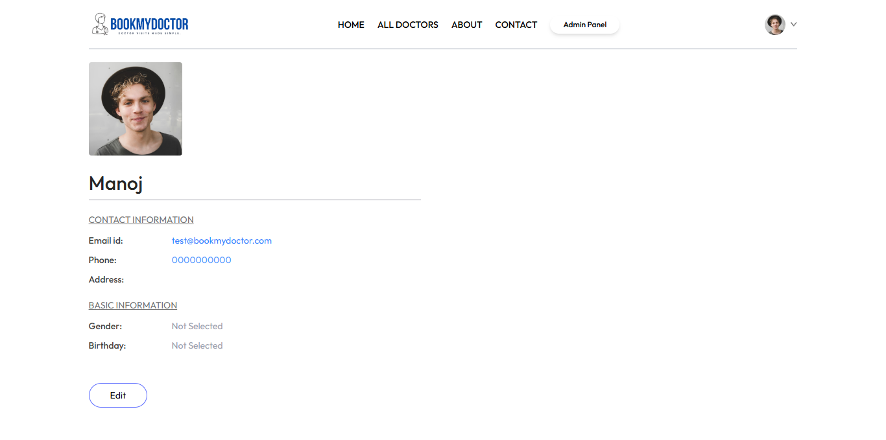
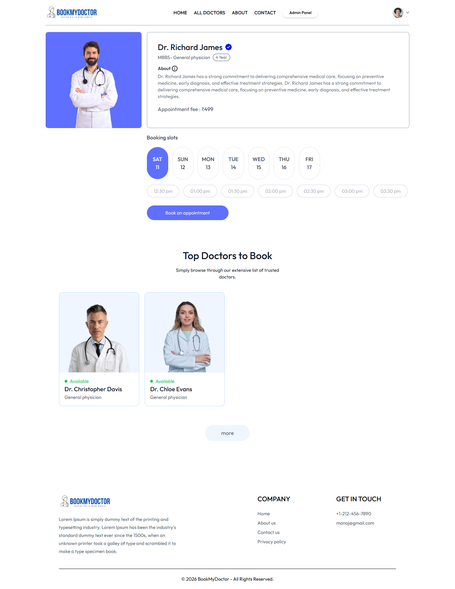
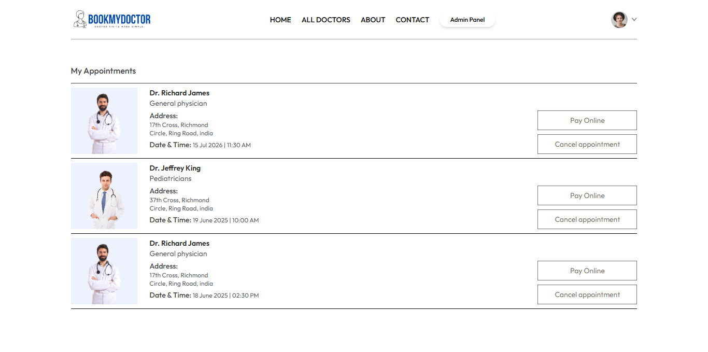
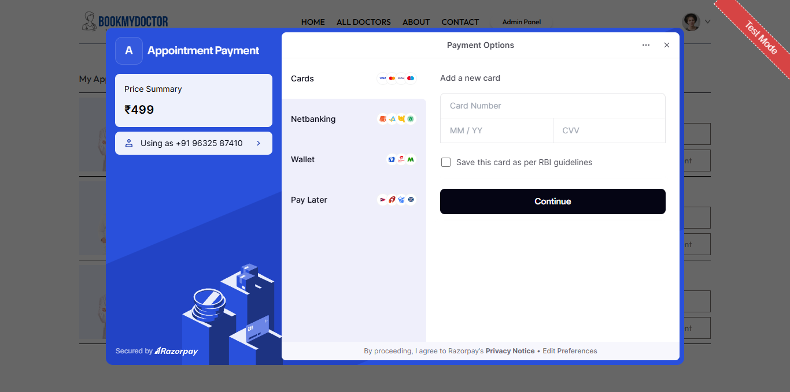
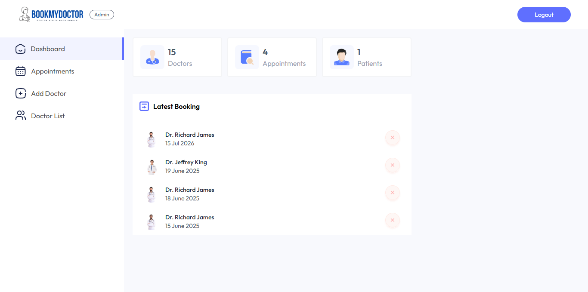
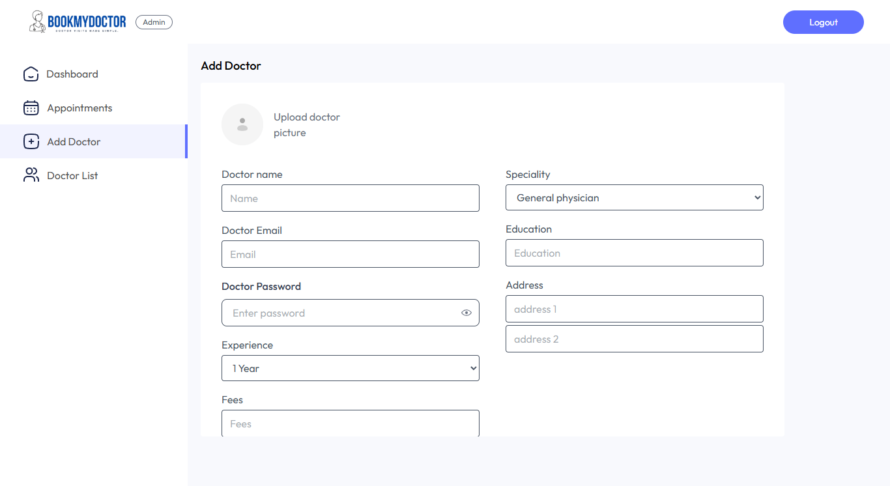
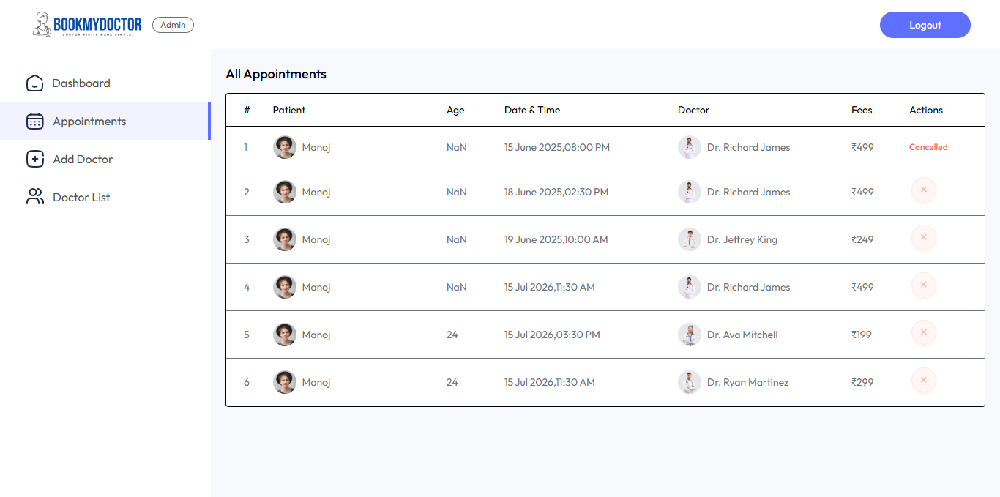
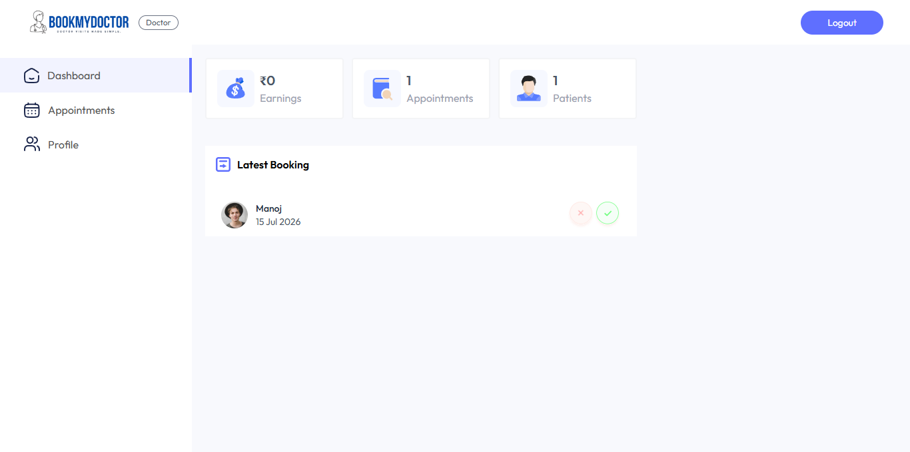
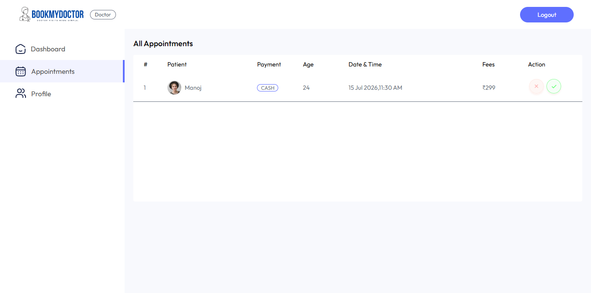
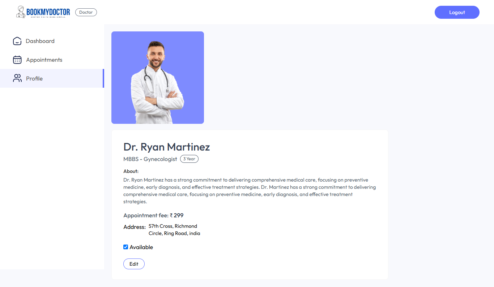

<div align="center">

# 🩺 BookMyDoctor

**A full-stack doctor appointment booking platform** with three dedicated portals — 🧑‍💼 **Patient**, 👨‍⚕️ **Doctor**, and 🛠️ **Admin** — supporting online consultation booking, doctor management, and integrated Razorpay payments.

[](https://book-my-doctor-one.vercel.app)


</div>

---

## 📑 Table of Contents

- [✨ Overview](#-overview)
- [📸 Screenshots](#-screenshots)
- [🎯 Features](#-features)
- [🧰 Tech Stack](#-tech-stack)
- [📂 Project Structure](#-project-structure)
- [🚀 Getting Started](#-getting-started)
- [🔐 Environment Variables](#-environment-variables)
- [🔌 API Overview](#-api-overview)
- [☁️ Deployment](#️-deployment)

---

## ✨ Overview

BookMyDoctor connects patients with doctors across specialities, letting patients browse doctors, book appointments, and pay online — while doctors manage their schedule and earnings, and admins oversee the entire platform.

The project is split into three independent apps:

| App | Description | Role |
|---|---|---|
| 🌐 `frontend` | Patient-facing website | Patient |
| 🛠️ `admin` | Management dashboard | Admin & Doctor |
| ⚙️ `backend` | REST API server | Shared by all three |

---

## 📸 Screenshots

### 🧑‍💼 Patient Site

| Home | All Doctors | About |
|---|---|---|
|  |  |  |

| Contact | Patient Profile | Book Appointment |
|---|---|---|
|  |  |  |

| My Appointments | Razorpay Payment |
|---|---|
|  |  |

### 🛠️ Admin Panel

| Dashboard | Add Doctor | Doctor Availability |
|---|---|---|
|  |  |  |

| All Appointments |
|---|
|  |

### 👨‍⚕️ Doctor Panel

| Dashboard | Patient Appointments | Profile |
|---|---|---|
|  |  |  |

---

## 🎯 Features

### 🧑‍💼 Patient
- 🔐 Register/login with JWT-based authentication
- 🔎 Browse doctors by speciality
- 👀 View doctor profiles (experience, fees, about, availability)
- 📅 Book, view, and cancel appointments
- 💳 Pay consultation fees online via **Razorpay**
- ✏️ Update personal profile (with image upload via Cloudinary)

### 👨‍⚕️ Doctor
- 🔐 Secure doctor login
- 📊 Dashboard with earnings, appointments, and patient stats
- ✅ View, complete, or cancel booked appointments
- 🟢 Toggle availability on/off
- ✏️ Update profile details

### 🛠️ Admin
- 🔐 Secure admin login
- ➕ Add new doctors with image, speciality, fees, and credentials
- 📋 View and manage all registered doctors
- 🟢 Toggle doctor availability
- ❌ View all appointments across doctors and cancel a patient's appointment (e.g. when a doctor becomes unavailable)
- 📊 Dashboard overview of doctors, patients, and appointments

---

## 🧰 Tech Stack

**Frontend & Admin Panel**
- ⚛️ React 19 + Vite
- 🧭 React Router DOM
- 🎨 Tailwind CSS
- 🔗 Axios
- 📝 Formik & Yup (form validation)
- 🔔 React Toastify (notifications)

**Backend**
- 🟢 Node.js + Express 5
- 🍃 MongoDB + Mongoose
- 🔑 JSON Web Token (JWT) authentication
- 🔒 Bcrypt.js (password hashing)
- 📤 Multer (file uploads)
- ☁️ Cloudinary (image storage)
- 💳 Razorpay (payments)

**Deployment**
- ▲ Vercel (frontend, admin panel, and backend)

---

## 📂 Project Structure

```
BookMyDoctor/
├── frontend/          # 🌐 Patient-facing React app
├── admin/             # 🛠️ Admin + Doctor dashboard React app
├── backend/           # ⚙️ Express REST API
│   ├── controllers/   # Route handlers (user, doctor, admin)
│   ├── models/        # Mongoose schemas
│   ├── routes/        # API route definitions
│   ├── middlewares/   # Auth (JWT) & Multer middleware
│   └── config/        # MongoDB & Cloudinary config
└── screenshots/       # 📸 App screenshots used in this README
```

---

## 🚀 Getting Started

### ✅ Prerequisites
- Node.js (v18+)
- MongoDB database (e.g. MongoDB Atlas)
- Cloudinary account
- Razorpay account (test/live keys)

### 1️⃣ Clone the repository
```bash
git clone https://github.com/manoj-pandi/BookMyDoctor.git
cd BookMyDoctor
```

### 2️⃣ Backend setup
```bash
cd backend
npm install
# create a .env file (see Environment Variables below)
npm run server
```

### 3️⃣ Frontend setup
```bash
cd frontend
npm install
# create a .env file (see Environment Variables below)
npm run dev
```

### 4️⃣ Admin panel setup
```bash
cd admin
npm install
# create a .env file (see Environment Variables below)
npm run dev
```

---

## 🔐 Environment Variables

### `backend/.env`
| Variable | Description |
|---|---|
| `MONGODB_URI` | MongoDB connection string |
| `CLOUDINARY_NAME` | Cloudinary cloud name |
| `CLOUDINARY_API_KEY` | Cloudinary API key |
| `CLOUDINARY_API_SECRET` | Cloudinary API secret |
| `ADMIN_EMAIL` | Admin login email |
| `ADMIN_PASSWORD` | Admin login password |
| `RAZORPAY_KEY_ID` | Razorpay Key ID |
| `RAZORPAY_KEY_SECRET` | Razorpay Key Secret |
| `JWT_SECRET` | Secret used to sign JWT tokens |
| `CURRENCY` | Currency code used for payments (e.g. `INR`) |

### `frontend/.env`
| Variable | Description |
|---|---|
| `VITE_BACKEND_URL` | URL of the deployed backend API |
| `VITE_RAZORPAY_KEY_ID` | Razorpay public Key ID (used by Checkout.js) |

### `admin/.env`
| Variable | Description |
|---|---|
| `VITE_BACKEND_URL` | URL of the deployed backend API |

> ⚠️ **Note:** Since `frontend` and `admin` use Vite, all `VITE_*` variables are baked into the JS bundle at **build time**. When deploying on Vercel, adding or changing these variables requires a fresh deployment (redeploy without build cache) to take effect.

---

## 🔌 API Overview

Base routes exposed by the backend:

| Route prefix | Purpose |
|---|---|
| `/api/user` | Patient registration/login, profile, appointments, Razorpay payment & verification |
| `/api/doctor` | Doctor login, profile, appointments, dashboard, availability |
| `/api/admin` | Admin login, doctor management, all appointments, dashboard |

🔑 Authentication is handled via JWT, sent in request headers and verified by role-specific middleware (`authUser`, `authDoctor`, `authAdmin`).

---

## ☁️ Deployment

All three apps (`frontend`, `admin`, `backend`) are deployed independently on **▲ Vercel**. Each project requires its own set of environment variables (see above) configured in **Project Settings → Environment Variables**, followed by a redeploy whenever those values change.

---

<div align="center">

Made with ❤️ for making healthcare appointments simpler.

</div>
